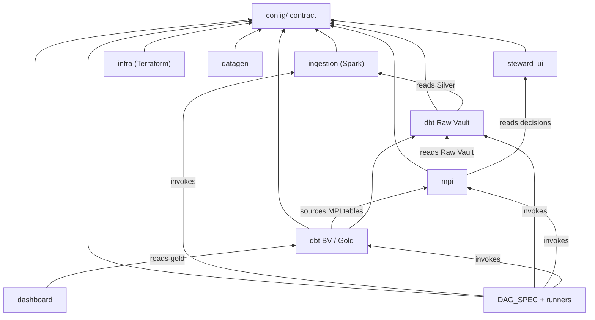
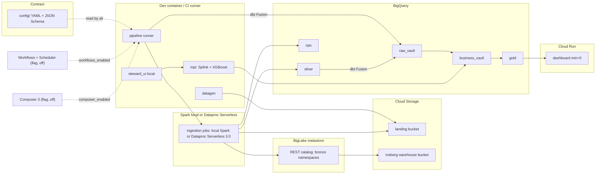
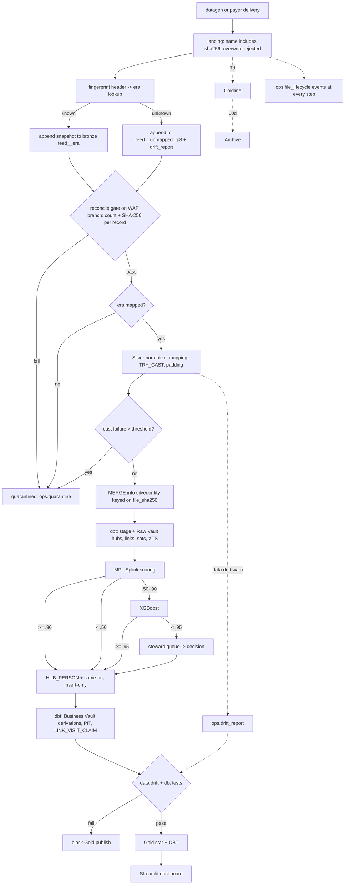
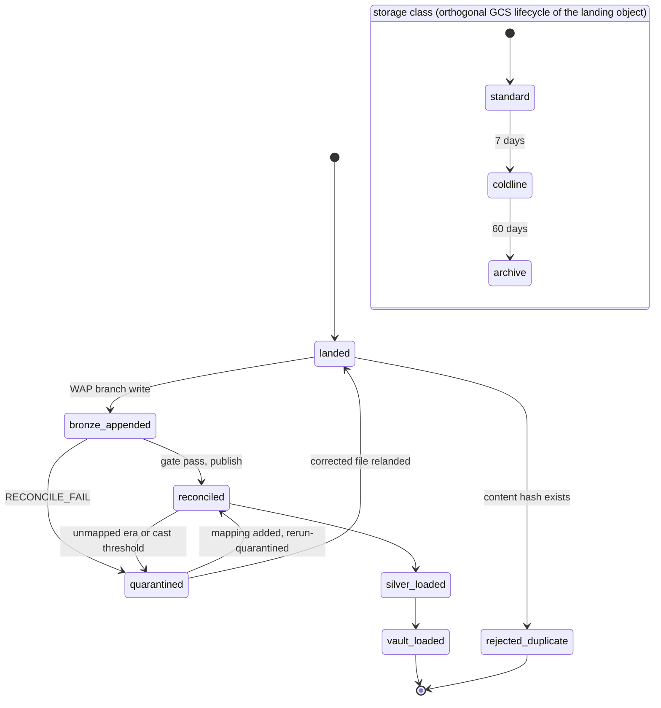
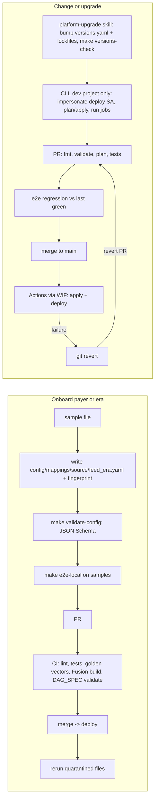
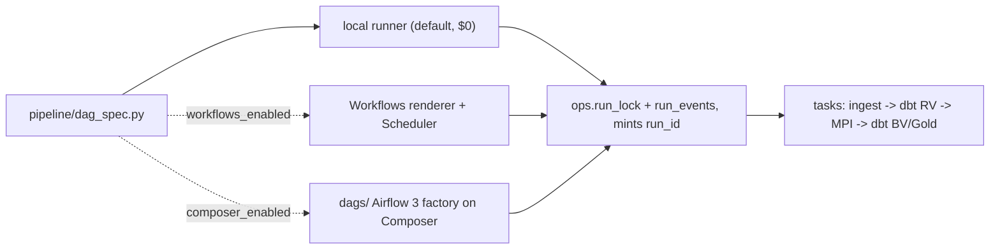
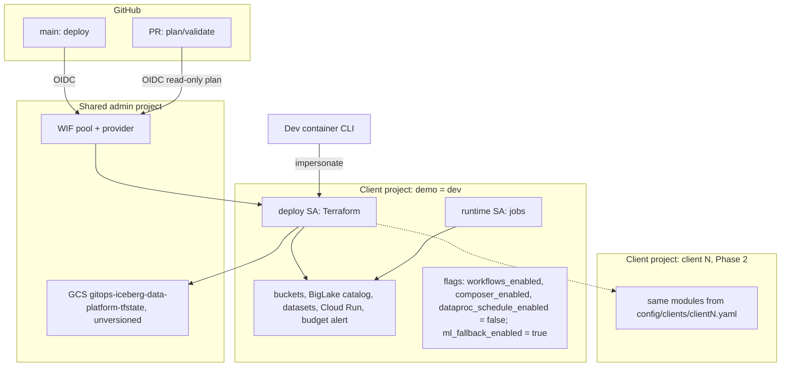

# Architecture Spine — Healthcare DV Platform Upgrade

## Design Paradigm

Metadata-driven medallion, pipes-and-filters. Every stage is a filter reading the previous layer and writing exactly one table class; every name, hash rule, PHI tag, partition, threshold, cap and flag comes from `config/`. Layers to directories:

| Layer / filter | Directory | Writes |
| --- | --- | --- |
| Contract | `config/` | nothing (read by all) |
| Source simulation | `datagen/` | landing bucket |
| Landing -> Bronze -> Silver | `ingestion/` (PySpark) | Bronze Iceberg, Silver, `ops` |
| Raw Vault, non-MPI Business Vault, Gold | `dbt/` (Fusion) | `raw_vault`, `business_vault`, `gold` |
| MPI | `mpi/` | BV MPI tables, `steward.review_queue`, `mpi_eval` |
| Extracts | `extracts/` | extract files from `gold` |
| Steward HITL | `steward_ui/` | `steward.decision` |
| Consumption | `dashboard/` | nothing |
| Orchestration | `pipeline/` (runner + DAG_SPEC), `dags/` (Airflow factory) | `ops.run_events`, `ops.run_lock`, `vault_loaded` states |
| Infrastructure | `infra/` | GCP resources |

## Invariants & Rules

### AD-1 — Single YAML contract in config/ [ADOPTED]

- **Binds:** all; FR-8, FR-9, FR-29, SM-2
- **Prevents:** re-declared names, hash rules, PHI tags, caps or flags drifting between Terraform, Spark, dbt, MPI and orchestration.
- **Rule:** `config/defaults.yaml` + `config/clients/<client>.yaml` + mappings/canonical schemas, validated by JSON Schema in `config/schemas/`. Terraform reads it via `yamldecode`; Python via the shared loader `config/loader.py`. Deep-merge semantics live only in the loader: it emits `config/build/<client>.resolved.yaml`, which Terraform `yamldecode`s (Terraform never `merge()`s layers itself) and from which dbt vars are generated; CI fails if the resolved file is stale. Flags are one `flags:` map with exact keys (`workflows_enabled`, `composer_enabled`, `dataproc_schedule_enabled`, `ml_fallback_enabled`), JSON Schema `additionalProperties: false`. Cost-bearing flags default false; `ml_fallback_enabled` (local XGBoost, not cost-bearing) defaults true. No consumer hardcodes a value the contract defines. Layout stays Atmos-migratable (Atmos deferred to the Enhancement phase). Onboarding a source or era touches only `config/`.

### AD-2 — One writer per table class [ADOPTED]

- **Binds:** all write paths; FR-6, FR-10, FR-14, FR-18, FR-20, FR-24
- **Prevents:** two mutation paths into one table.
- **Rule:** Spark ingestion writes Bronze, Silver, `ops.file_lifecycle` states up to `silver_loaded`, `ops.quarantine` and `ops.drift_report` (sole drift computer). The pipeline runner alone writes `ops.run_events`, `ops.run_lock` and downstream lifecycle states (`vault_loaded`); dbt and MPI never write `ops`. dbt Fusion writes Raw Vault, non-MPI Business Vault and Gold. MPI Python writes `HUB_PERSON`, same-as links and the effectivity satellite on `LINK_PERSON_SAME_AS`, member/patient-person links and `SAT_MPI_MATCH_DETAILS`. MPI also writes `steward.review_queue` and `mpi_eval.*` (AD-23, AD-25). Steward app writes only `steward.decision`. A reader of another writer's table declares it as a source; it never writes it.

### AD-3 — Immutable content-hashed landing with tiering, never deleted by the pipeline; destroyed at POC teardown [ADOPTED]

- **Binds:** FR-5, NFR-3
- **Prevents:** silent overwrite and loss of the raw original.
- **Rule:** landing object path includes `_file_sha256`; overwrite of an existing name is rejected (write with `ifGenerationMatch=0`; runtime SA has create but not delete/overwrite on landing). A file whose `_file_sha256` already exists in `ops.file_lifecycle` is `rejected_duplicate` regardless of name. The pipeline never deletes landing objects. GCS lifecycle: Standard -> Coldline at 7 days -> Archive at 60 days; no delete rule. POC teardown: landing bucket has `force_destroy` and no retention-policy lock, so `terraform destroy` deletes it (data regenerable from the seeded generator; Coldline/Archive early-deletion charges accepted); production landing carries a delete lock (Future Enhancement). Bronze is the queryable system of record once loaded.

### AD-4 — Bronze Iceberg per (source, feed, schema era) [ADOPTED]

- **Binds:** FR-6, FR-7, FR-12
- **Prevents:** table explosion, Hadoop-catalog hacks and unprovable 1:1 fidelity.
- **Rule:** Bronze is the only Iceberg layer; all columns STRING (nested = one JSON string column); catalog = BigLake metastore REST catalog. One table per (source, feed, era), partitioned by `day(_ingested_at)`; one append snapshot per delivery, snapshot summary tagged with `run_id` and `file_sha256`; rows never updated or deleted. Each row carries `_raw_line` and `_line_ordinal`. Idempotent write-audit-publish: skip if `ops.file_lifecycle` already shows `bronze_appended` for the `file_sha256`; else write to Iceberg branch `wap_<sha8>`, run the reconcile gate on the branch, fast-forward main only on pass. Lifecycle enum is closed in `config/standards/lifecycle.yaml`: `landed -> bronze_appended -> reconciled -> silver_loaded -> vault_loaded`, plus `rejected_duplicate`, `quarantined`. Silver selects only files whose latest state is `reconciled`. Reconcile gate = record count + SHA-256 of each raw record's bytes (no normalization) vs the landing object; record split per format in `config/standards/records.yaml` (newline for JSONL/CSV under RFC 4180, ISA16 segment terminator for X12, BOM stripped; non-UTF-8 records stored base64 with a flag). AD-7 MD5 is for vault keys only. Maintenance: `rewrite_manifests` and metadata compaction allowed; no Bronze expiration: `expire_snapshots` is never run and no data file is removed. POC teardown: `terraform destroy` deletes Bronze tables and the warehouse bucket (all data regenerable from the seeded generator); production Bronze carries a delete lock (Future Enhancement).

### AD-5 — Era identity is the schema fingerprint [ADOPTED]

- **Binds:** FR-2, FR-3, FR-9, FR-11
- **Prevents:** date-bound era guesses misrouting drifted files.
- **Rule:** the Bronze loader is the sole era authority: it computes a fingerprint of the header/segment layout and looks it up in config. Unknown fingerprint -> table era `unmapped_<fp8>` (lowercase hex), drift_report row, Silver skips it (`quarantined`, `UNMAPPED_ERA`) until a mapping is added. Recovery binds the fingerprint to an era in config; the rows stay in `unmapped_<fp8>`, are never re-appended, and Silver reads that table under the bound era's mapping. A fingerprint whose columns are an additive-only superset of a mapped era's maps to that era: Silver pads the extra columns per the mapping and writes a drift_report row; the file is not quarantined. Era names match `^[a-z0-9_]+$`. Exactly one mapping per (source, feed, era). Fingerprint algorithm per AD-22.

### AD-6 — Lineage columns set at landing, never restamped [ADOPTED]

- **Binds:** NFR-3, FR-13, FR-28
- **Prevents:** lineage lost or rewritten on rerun.
- **Rule:** `_record_source`, `_source_file`, `_file_sha256`, `_line_ordinal`, `_run_id`, `_ingested_at` are assigned at landing/Bronze and propagated unchanged to Silver and vault staging; every satellite row keeps `_file_sha256` and `_line_ordinal`, and a dbt test asserts every Gold row traces to a Bronze line. MPI rows carry `run_id`, `model_version` and the applied `decision_id`. `load_dts` derives from `_ingested_at`; for a file recovered from `unmapped_<fp8>`, `load_dts` = its `silver_loaded` event time.

### AD-7 — Hash specification shared by all engines [ADOPTED]

- **Binds:** FR-13, FR-15, FR-16, NFR-2
- **Prevents:** Spark, dbt and MPI computing different keys for the same business key.
- **Rule:** MD5, uppercase hex STRING. Normalization in `config/standards/hashing.yaml`: Unicode NFC; ASCII-whitespace trim; ASCII uppercase for business keys only (hashdiff values are not case-folded); empty string -> NULL -> sentinel `^^`; delimiter `||` with `\` escaping of `|` and `\` in values; canonical formats (ISO-8601 dates, UTC `YYYY-MM-DDTHH:MM:SS.ffffffZ` timestamps, decimals without trailing zeros); hashdiff column order taken from config, never alphabetical by engine; all-null business key rejected. Business-key recipes per hub (ordered columns + qualifier) in `config/standards/business_keys.yaml`: payer feeds qualify with payer id, EMR feeds with EMR system id; member key = payer + subscriber id + `person_code`; pharmacy claim key = payer + Rx number + fill number + pharmacy NPI + date of service. Contract confirmed. Golden vectors per rule and per hub; spec and golden test vectors in `config/standards/hashing.yaml`. Every engine's implementation runs the golden vectors in CI. FARM_FINGERPRINT forbidden. Vault macros are in-house (`dv_hash`, `build_hub`, `build_link`, `build_sat`).

### AD-8 — One canonical Silver table per entity, idempotent write [ADOPTED]

- **Binds:** FR-8, FR-10, FR-28, FR-31, FR-32, FR-33, NFR-8
- **Prevents:** per-source Silver forks and duplicate rows on rerun.
- **Rule:** eight canonical entities: claim, claim_line, eligibility, remittance_835, pharmacy, provider, patient, encounter. Each declares in config a PHI tag per column (metadata only in the POC), partition date column, up to 4 cluster columns (first `_source_file`) (partitioning confirmed), and `applied_dts` column (UTC TIMESTAMP; Spark converts business DATEs using the source timezone declared in the mapping). Entity names and the entity-to-hub map live in `config/standards/entities.yaml`. Spark normalizes Bronze -> Silver directly into native BigQuery via staging + MERGE/DELETE+INSERT keyed on `_file_sha256`; rerun is a no-op. No hub without a canonical feed.

### AD-9 — Quarantine and drift precedence [ADOPTED]

- **Binds:** FR-10, FR-11, FR-36, NFR-5
- **Prevents:** partial files reaching the vault and inconsistent gate behavior.
- **Rule:** cast failure -> null + counted. Per-column cast-failure rate above threshold (default 5%) quarantines the whole file. Precedence: reconcile fail > unmapped era > cast threshold > data-drift. Data drift warns at Silver and blocks at Gold publish; only Spark computes drift (`ops.drift_report`), and the Gold gate is a dbt test reading it as a source. With no thresholds configured, drift is reported but never blocks. Quarantine zone = the file's Bronze rows (never copied or re-appended) plus its `quarantined` lifecycle state; `ops.quarantine` holds one row per (file, reason, column). Replay = add mapping or fix, then `make rerun-quarantined`, which re-runs Silver for those `file_sha256`s; Bronze is untouched.

### AD-10 — ops dataset is the processing log [ADOPTED]

- **Binds:** FR-5, FR-6, FR-11, FR-28, NFR-3
- **Prevents:** catalog listing as discovery and unknown file whereabouts.
- **Rule:** `ops.file_lifecycle`, `ops.quarantine`, `ops.drift_report`, `ops.run_events` are append-only. `file_lifecycle` is the Bronze index; stages discover work from it, never by listing the catalog. A storage-class reconciler (lifecycle actions are not audit-logged) appends observed class moves.

### AD-11 — Insert-only satellites with late-arrival handling [ADOPTED]

- **Binds:** FR-14, FR-23
- **Prevents:** reprocessing on out-of-order data and wrong current-state rows.
- **Rule:** satellites carry `load_dts` (receipt, monotonic) and `applied_dts` (business). An extended tracking satellite records every hashdiff seen; an out-of-sequence row triggers a corrective insert of its successor. Total order for a key: (`applied_dts`, `load_dts`, `_file_sha256`, `_line_ordinal`); corrective inserts take the current `load_dts`, never a backdated one; claim status resolves by frequency code + sequence, so a void arriving before its original is held as the latest version. Scenario tests for each case live with `build_sat`. Logic lives only in `build_sat`. PIT tables rebuild only the affected applied-date window. Ghost records for misses.

### AD-12 — Claims versioning and derived links in Business Vault [ADOPTED]

- **Binds:** FR-14, FR-22
- **Prevents:** replacements/voids creating new claims and derived rules polluting Raw Vault.
- **Rule:** replacements and voids share `HUB_CLAIM` on payer + original claim id; `SAT_CLAIM_VERSION` carries frequency code + sequence. `LINK_VISIT_CLAIM` is a Business Vault derivation.

### AD-13 — Golden key HUB_PERSON owned by MPI [ADOPTED]

- **Binds:** FR-16, FR-17, FR-18, FR-19, FR-20, FR-21, FR-24
- **Prevents:** member-only golden keys and mixing golden keys with Raw Vault hash keys.
- **Rule:** `golden_person_hk` covers payer members and EMR patients via `LINK_MEMBER_PERSON` and `LINK_PATIENT_PERSON`. Bands: [0, .50) new, [.50, .90) edge -> XGBoost, [.90, 1] auto; ML auto at >= .95 else steward; values in config. `golden_person_hk` = MD5(`'PERSON'` || first_record_hk) per AD-7, where first_record_hk is the member/patient hk that founded the cluster. Survivorship = earliest `HUB_PERSON.load_dts`; links never deleted. MPI writes insert-only per `run_id` with deterministic link hks and score-row hashdiffs, so an identical rerun inserts nothing; every score row carries `model_version` and `threshold_set_version`. Merges and un-merges are recorded in an effectivity satellite on `LINK_PERSON_SAME_AS` (status active/ended), never by delete. An edge that would violate must-not-link is dropped and logged; must-not-link is also checked on the full cluster after transitive closure and overrides auto bands; clusters above a config max size are not auto-merged and route to the steward queue. dbt reads MPI tables only for `run_id`s with a `mpi_complete` event in `ops.run_events`. Retrain: steward decisions + generator ground truth feed XGBoost training (fixed seed, train/test split by person); a new model is promoted only if it beats the current one on the AD-25 untouched eval seed AND still meets the SM-C1 false-merge rate (F1 does not drop); steward labels on eval-seed records never enter training. Gold `DIM_PATIENT` keys on `golden_person_hk`.

### AD-14 — PHI tag metadata and synthetic-only guardrail [ADOPTED] (build deferred to Enhancement phase)

- **Binds:** NFR-4 (partial: `phi` tag metadata only; masking and HMAC in Future Enhancement Phase), NFR-9, FR-25, FR-26, FR-35
- **Prevents:** a schema change when PHI hardening is built, and real PHI entering the POC.
- **Rule:** every canonical schema column carries a `phi` tag field in config (metadata only; no routing, masking or tokenization in the POC). Only synthetic data is processed: every file carries the synthetic marker, checked in CI and refused by the loader if absent. IAM is ordinary least privilege (deploy SA, runtime SA, dashboard SA). Dashboard and extracts read `gold` directly. PHI hardening designs live in Future Enhancement Phase.

### AD-15 — dbt Fusion is the blocking build [ADOPTED]

- **Binds:** FR-13..FR-15, FR-22..FR-24, NFR-5, NFR-7, SM-8
- **Prevents:** dual-track drift and unanalyzable models.
- **Rule:** Fusion is the only dbt build and blocks CI; `static_analysis: strict`; login-free column-level lineage satisfies the lineage requirement, dbt platform login optional; no Python models; no Iceberg reads (Silver is native BigQuery). No dbt Core fallback. Fusion smoke gate (build + CLL on BigQuery) runs early in Phase 1.

### AD-16 — Cost posture [ADOPTED]

- **Binds:** NFR-1, FR-12, FR-25, FR-34
- **Prevents:** always-on spend exceeding the USD 5 budget.
- **Rule:** cost-bearing services (Composer, Workflows/Scheduler, scheduled Dataproc) are Terraform flags defaulting off; `ml_fallback_enabled` is not cost-bearing and defaults on. Every engine sets a bytes-billed cap from config. Dashboard Cloud Run min instances 0. Dataproc Serverless runs opt-in (standard tier, no Spot), at most 10 per POC, counted in `ops.run_events` and refused by the runner past the cap; batches set a TTL. CI fails if an engine config lacks a bytes cap. Budget alerts only.

### AD-17 — Orchestration declared once [ADOPTED]

- **Binds:** FR-27, FR-28, NFR-6
- **Prevents:** divergent DAGs per orchestrator and CI-coupled logic.
- **Rule:** `pipeline/dag_spec.py` declares tasks and edges once. Default executor = local Python runner ($0). Cloud Workflows + Scheduler (`workflows_enabled`) and Airflow 3 DAG factory on Composer (`composer_enabled`) render from the same spec, both off. Composer operators confined to `dags/` task factory. Every task idempotent and resumable via `ops`. One pipeline run per client at a time: the runner takes `ops.run_lock` (insert-if-absent with TTL) and every executor honors it. Default Spark executor for local and CI runs = local Spark with versions from `versions.yaml` matching Dataproc runtime 3.0 (Spark 4.0, Java 21, Iceberg `4.0_2.13`); Dataproc on opt-in.

### AD-18 — Deploy and auth [ADOPTED]

- **Binds:** FR-38, FR-39, NFR-9, NFR-10
- **Prevents:** key leakage and state-lock collisions.
- **Rule:** GitHub Actions authenticates via WIF; no JSON keys. CLI impersonates the deploy SA. Runtime SA is separate from the Terraform SA. State stays in `gitops-iceberg-data-platform-tfstate` unversioned, with a backend comment that production needs versioning. CLI-first iteration; no CLI apply while a main deploy runs. PR = plan/validate; merge to main = deploy.

### AD-19 — One GCP project per client [ADOPTED]

- **Binds:** FR-29, FR-30
- **Prevents:** cross-client data and IAM bleed.
- **Rule:** each `config/clients/<client>.yaml` names its `project_id` and `region`; all resources are created in that project; dev = demo client. The POC has no staging or prod environment. `config/clients/_template.yaml` is the onboarding profile.

### AD-20 — Version policy and manual upgrade [ADOPTED]

- **Binds:** NFR-2, FR-40
- **Prevents:** unpinned drift and per-commit bot noise.
- **Rule:** track latest stable, always pinned. Native pins stay native; non-registry pins (Dataproc runtime, Composer image, Fusion, Iceberg coords) in `versions.yaml`, read by Terraform, CI and runners. Lockfiles committed (`.terraform.lock.hcl` multi-platform, `uv.lock`, dbt `package-lock.yml`). Upgrades are manual via `make upgrade` and `.claude/skills/platform-upgrade/`; gate = full CI + e2e regression vs last green; rollback = revert. No Dependabot.

### AD-21 — Python 3.12 everywhere [ADOPTED]

- **Binds:** all Python units
- **Prevents:** interpreter splits between Spark, MPI and apps.
- **Rule:** Dataproc Serverless 3.0 (Python 3.12) for Spark; every uv project pins `requires-python = "==3.12.*"`. Excludes the flagged-off Composer image, whose interpreter is whatever the image ships; `dags/` must import under it. Runtime 3.0 is non-LTS (end of support 2027-01-31), see Deferred.

### AD-22 — Schema fingerprint specification [ADOPTED]

- **Binds:** FR-2, FR-3, FR-9, FR-11
- **Prevents:** the onboarding tool and the Bronze loader computing different fingerprints, sending every file to `unmapped_<fp8>`.
- **Rule:** algorithm per file format in `config/standards/fingerprint.yaml` (CSV: ordered header names, NFC, trimmed, lowercased; JSONL: sorted set of top-level keys of the first N records; X12: ordered segment-id layout of the first transaction set), joined by `\n`, SHA-256, lowercase hex; `fp8` = first 8 chars. One implementation in `config/fingerprint.py`, with golden vectors run in CI by the loader and the onboarding CLI.

### AD-23 — Steward contract [ADOPTED]

- **Binds:** FR-19, FR-20, FR-21
- **Prevents:** queue and decision tables with undefined keys or two writers.
- **Rule:** MPI writes `steward.review_queue(candidate_id, pair_hk, scores, model_version, run_id, queued_at)`. The steward app writes `steward.decision(decision_id, pair_hk, decision {match, no_match, must_not_link, unmerge, defer}, scores_at_decision, model_version, reason, os_user, host, decided_at, supersedes)`, insert-only; the latest decision per `pair_hk` wins, and disagreement between two stewards queues a second review. MPI applies decisions idempotently by `decision_id`.

### AD-24 — Run identity [ADOPTED]

- **Binds:** FR-27, FR-28, NFR-3
- **Prevents:** runner, dbt and MPI minting different run ids.
- **Rule:** only the pipeline runner mints `run_id` and passes it to every task (Spark arg, dbt var, MPI arg). `_run_id` is lineage only; work selection always uses `ops` state, never `_run_id`.

### AD-25 — MPI evaluation harness and metrics [ADOPTED]

- **Binds:** FR-17, FR-18, FR-19, SM-3
- **Prevents:** unmeasured or leaky match-quality claims.
- **Rule:** datagen writes ground truth (`person_truth`) to `mpi_eval.ground_truth`, never readable as a feature. Evaluation uses a held-out generator seed distinct from the training seed, splits by person, and reports pairwise precision/recall/F1 and B-cubed per run to `mpi_eval.metrics`. Model artifacts are versioned in a versioned model artifact bucket (runtime SA only, ordinary least-privilege IAM); the ML fallback is gated by `flags.ml_fallback_enabled` (default true; local XGBoost, no service cost).

Dependency direction (arrow = depends on / reads from, the reverse of data flow; nothing may point back up):



Run order dbt Raw Vault -> MPI -> dbt Business Vault/Gold keeps the graph acyclic; both dbt nodes are one Fusion project selected by folder. No code imports across units except `config/loader.py`.

## Consistency Conventions

| Concern | Convention |
| --- | --- |
| Datasets | `landing` bucket `<project>-landing`; Bronze namespace `bronze_<source>`; BigQuery datasets `silver`, `raw_vault`, `business_vault`, `gold`, `ops`, `steward`, `mpi_eval` |
| Bronze tables | `<feed>__<era>`, era `^[a-z0-9_]+$` (from config or `unmapped_<fp8>`); BigQuery read mirror datasets `bronze_<source>`, readable by the runtime SA only |
| Silver tables | `silver.<entity>` singular snake_case, list fixed in `config/standards/entities.yaml` |
| Vault objects | `HUB_<ENTITY>`, `LINK_<A>_<B>`, `SAT_<PARENT>_<CONTEXT>`, `PIT_<ENTITY>`, `XTS_<PARENT>`; keys `<entity>_hk`, hashdiff `hashdiff` |
| Gold | `DIM_<X>`, `FCT_<X>`, `OBT_<X>` |
| Config files | `config/mappings/<source>/<feed>_<era>.yaml`; `config/schemas/canonical_<entity>.json`; `config/clients/<client>.yaml`; `config/standards/*.yaml` |
| Ids | hash keys MD5 upper-hex STRING; `run_id` = UTC `YYYYMMDDTHHMMSSZ-<8hex>`, minted by runner only; file identity `_file_sha256`; record hash SHA-256 lower-hex |
| Dates/timestamps | all TIMESTAMP in UTC; `load_dts` and `applied_dts` both UTC TIMESTAMP (business DATEs converted in Spark using the mapping's declared source timezone) |
| Lineage columns | `_record_source`, `_source_file`, `_file_sha256`, `_line_ordinal`, `_run_id`, `_ingested_at`, `_raw_line` (Bronze only) |
| Ops events | states from `config/standards/lifecycle.yaml`; one row per transition: `file_sha256, stage, state, storage_class, location, run_id, event_ts, detail JSON` |
| Error / quarantine shape | `file_sha256, source, feed, era, reason_code, column, failure_rate, threshold, run_id, event_ts`; one row per (file, reason, column); reason codes `RECONCILE_FAIL`, `UNMAPPED_ERA`, `CAST_THRESHOLD`, `DATA_DRIFT`; `detail` never holds values |
| Logging | structured JSON to stdout; no row values in logs or `ops` |
| Test/scratch hygiene | dbt `store_failures` off; DuckDB in-memory only (no on-disk DB files) |
| Secrets | Secret Manager or CI secrets only; never in config or tfvars |
| Flags | one `flags:` map of `<service>_enabled` booleans, exact keys per AD-1; cost-bearing default false, `ml_fallback_enabled` default true |
| Determinism | datagen takes `seed` from config (training and evaluation seeds differ); output files written with sorted content so reruns are byte-identical; `.env` holds only secrets-free local overrides, `config/` wins on conflict |
| Datagen ids | reserved synthetic ranges; NPIs pass Luhn; NDC normalized 10 -> 11 digits; no CPT/CDT descriptors in the repo (codes only); every file carries a synthetic marker checked in CI |

## Stack

| Name | Version |
| --- | --- |
| Python | 3.12 |
| Dataproc Serverless runtime | 3.0 |
| Apache Spark | 4.0 |
| Java | 21 |
| iceberg-spark-runtime-4.0_2.13 | 1.12.0 |
| spark-bigquery-connector | 0.42.3 (runtime 3.0 bundled, deliberate) |
| BigLake metastore | REST catalog |
| Terraform | 1.16.5 |
| hashicorp/google, google-beta | 8.6.0 |
| tflint | 0.64.0 |
| dbt Fusion | 2.0.6 |
| Splink | 5.0.0 |
| XGBoost | 3.4.1 |
| DuckDB | 1.5.6 |
| Streamlit | 1.65.0 |
| uv | 0.12.23 |
| ruff | 0.16.10 |
| pytest | 9.1.1 |
| Composer image (flagged off) | composer-3-airflow-3.3.1-build.2 |
| astronomer-cosmos (flagged) | 1.15.1 |

## Structural Seed

**Container view.** Boxes are deployable units grouped by GCP service; the config contract is read by every unit; dashed edges are flag-gated services, off by default.



**Data process flow for one run.** Solid arrows are the happy path; the quarantine branch and lifecycle events write to `ops`.



**File lifecycle states.** Each transition appends one `ops.file_lifecycle` row.



**Developer and maintenance flows.** Left: onboarding a payer or schema era (config only). Right: infra/code change and manual upgrade.



**Orchestration.** One spec, three renderers; only the local runner is on by default.



**Vault entities** (names and relationships only).

```mermaid
erDiagram
  HUB_MEMBER ||--o{ SAT_MEMBER_DEMOGRAPHICS : describes
  HUB_PATIENT ||--o{ SAT_PATIENT_DEMOGRAPHICS : describes
  HUB_CLAIM ||--o{ SAT_CLAIM_HEADER : describes
  HUB_CLAIM ||--o{ SAT_CLAIM_ADJUDICATION : "835"
  HUB_CLAIM_LINE ||--o{ SAT_CLAIM_LINE : describes
  HUB_CLAIM_LINE ||--o{ SAT_CLAIM_LINE_DIAGNOSIS : "dx child"
  HUB_CLAIM_LINE ||--o{ SAT_CLAIM_LINE_PROCEDURE : "proc child"
  HUB_CLAIM ||--o{ LINK_CLAIM_LINE : has
  HUB_CLAIM_LINE ||--o{ LINK_CLAIM_LINE : of
  HUB_CLAIM ||--o{ SAT_CLAIM_VERSION : versions
  HUB_CLAIM ||--o{ XTS_CLAIM : tracks
  HUB_COVERAGE ||--o{ SAT_COVERAGE : describes
  HUB_PHARMACY_CLAIM ||--o{ SAT_PHARMACY_CLAIM : describes
  HUB_MEMBER ||--o{ LINK_MEMBER_PHARMACY_CLAIM : fills
  HUB_PHARMACY_CLAIM ||--o{ LINK_MEMBER_PHARMACY_CLAIM : of
  HUB_MEMBER ||--o{ LINK_MEMBER_CLAIM : has
  HUB_CLAIM ||--o{ LINK_MEMBER_CLAIM : has
  HUB_CLAIM ||--o{ LINK_CLAIM_PROVIDER : billed_by
  HUB_PROVIDER ||--o{ LINK_CLAIM_PROVIDER : bills
  HUB_MEMBER ||--o{ LINK_MEMBER_COVERAGE : enrolled
  HUB_COVERAGE ||--o{ LINK_MEMBER_COVERAGE : covers
  HUB_PATIENT ||--o{ LINK_PATIENT_VISIT : attends
  HUB_VISIT ||--o{ LINK_PATIENT_VISIT : of
  HUB_VISIT ||--o{ LINK_VISIT_PROVIDER : "seen by"
  HUB_PROVIDER ||--o{ LINK_VISIT_PROVIDER : "practitioner/facility NPI"
  HUB_PERSON ||--o{ LINK_MEMBER_PERSON : resolves
  HUB_MEMBER ||--o{ LINK_MEMBER_PERSON : resolved
  HUB_PERSON ||--o{ LINK_PATIENT_PERSON : resolves
  HUB_PATIENT ||--o{ LINK_PATIENT_PERSON : resolved
  HUB_PERSON ||--o{ LINK_PERSON_SAME_AS : master
  HUB_PERSON ||--o{ SAT_MPI_MATCH_DETAILS : scored
  HUB_VISIT ||--o{ LINK_VISIT_CLAIM : "BV derived"
  HUB_CLAIM ||--o{ LINK_VISIT_CLAIM : "BV derived"
  HUB_CLAIM ||--o{ SAT_CLAIM_COMPUTED : "BV computed"
  HUB_PERSON ||--o{ PIT_PERSON_CLAIMS : "as of"
```



**Deployment and environments.** One project per client; solid = always on, dashed = flag-gated.



```text
/
  config/            # contract: defaults.yaml, clients/ (+ _template.yaml), mappings/<source>/, schemas/, standards/, reference/, loader.py, fingerprint.py, build/
  datagen/           # modular synthetic generator, manifest + ground truth, samples/, README.md
  ingestion/         # PySpark: landing, EDI pre-parse (X12 -> JSONL), bronze WAP writer, reconcile, silver normalizer, drift, storage-class reconciler
  dbt/               # Fusion project: macros/ dv_hash build_hub build_link build_sat; models/ staging raw_vault business_vault gold
  mpi/               # Splink scoring, XGBoost fallback, golden key writer, retrain, eval harness
  extracts/          # HEDIS / regulatory / payer extract stubs + continuous-enrollment check, read gold
  steward_ui/        # local Streamlit steward app
  dashboard/         # Streamlit Gold dashboard + Cloud Run container
  pipeline/          # dag_spec.py, local runner, Workflows renderer
  dags/              # Airflow 3 DAG factory from dag_spec
  infra/             # Terraform modules + environments, reads config via yamldecode
  versions.yaml      # non-registry pins
  .claude/skills/platform-upgrade/  # manual upgrade skill
  .github/workflows/ # pr-validate.yml, deploy-main.yml, scheduled-e2e.yml (SM-6, volume_profile=ci)
  Makefile           # generate, normalize, vault, mpi, e2e-local, validate-config, rerun-quarantined, versions-check, upgrade
```

## Capability → Architecture Map

| Capability / Area | Lives in | Governed by |
| --- | --- | --- |
| 4.1 Synthetic generation (FR-1..FR-4, FR-36, FR-37) | `datagen/` | AD-1, AD-3, AD-5 |
| 4.2 Landing and Bronze (FR-5..FR-7) | `ingestion/`, GCS, BigLake | AD-3, AD-4, AD-5, AD-6, AD-10, AD-22 |
| 4.3 Silver normalization (FR-8..FR-12) | `ingestion/`, `config/mappings` | AD-1, AD-8, AD-9, AD-21 |
| 4.4 Raw Vault (FR-13..FR-15) | `dbt/` (hubs/links/sats per PRD §4.4 + `SAT_CLAIM_ADJUDICATION`, dx/proc child sats, `LINK_VISIT_PROVIDER` for FR-32) | AD-2, AD-7, AD-11, AD-12, AD-15 |
| 4.5 MPI (FR-16..FR-19) | `mpi/` | AD-2, AD-13, AD-23, AD-25 |
| 4.6 Steward HITL (FR-20, FR-21) | `steward_ui/`, `mpi/` | AD-2, AD-13, AD-23 |
| 4.7 BV derivations and Gold (FR-22..FR-24) | `dbt/` | AD-11, AD-12, AD-13, AD-15 |
| 4.8 Consumption (FR-25, FR-26) | `dashboard/`, `gold` | AD-14 (synthetic guardrail only), AD-16 |
| 4.9 Orchestration (FR-27, FR-28) | `pipeline/`, `dags/` | AD-10, AD-17, AD-24 |
| 4.10 Client onboarding (FR-29, FR-30) | `config/clients/`, `infra/` | AD-1, AD-19 |
| 4.11 Coverage, provider, pharmacy, cost, privacy (FR-31..FR-35) | `ingestion/`, `dbt/`, all engines | AD-8, AD-14 (PHI tag metadata + synthetic guardrail only), AD-16 |
| 4.12 Continuous delivery (FR-38..FR-40) | `.github/workflows/`, `infra/` | AD-18, AD-20 |
| Seeds, determinism, generator manifest + ground truth (FR-1..FR-4) | `datagen/`, `mpi_eval.ground_truth` | AD-25, Determinism convention |
| X12 EDI pre-parse to JSONL (FR-7) | `ingestion/edi/` | AD-4, AD-22 |
| Reference/code data + licensing guard (codes only, no CPT/CDT text) | `config/reference/`, CI | Datagen ids convention |
| Dataproc TTL guard + run counter | `pipeline/`, `ops.run_events` | AD-16 |
| MPI metrics, model registry, ML flag, retrain promotion gate | `mpi/`, `mpi_eval`, artifact bucket | AD-13, AD-25 |
| Extract stubs + continuous-enrollment check (FR-26) | `extracts/` | AD-14 (synthetic guardrail only) |
| Run lock (FR-28) | `pipeline/`, `ops.run_lock` | AD-17, AD-24 |
| Template client profile | `config/clients/_template.yaml` | AD-19 |
| CI guards: Payer C zero-diff, bytes cap per engine, repo weight, synthetic marker, golden vectors | `.github/workflows/pr-validate.yml` | AD-7, AD-14, AD-16, AD-22 |
| Scheduled CI-volume e2e (SM-6) | `.github/workflows/scheduled-e2e.yml`, `volume_profile` in config | AD-1, AD-17 |
| NFR-1..NFR-10 | cross-cutting | AD-14 (NFR-4 partial, NFR-9), AD-16, AD-18, AD-20 |

## Migration from the current repo

| Today | Target |
| --- | --- |
| Taxi demo code under `src/{composer,dbt_project,looker_project,spark_jobs}` | Tagged and preserved on branch `v1`, removed from `main` |
| `gitops/` (Argo CD) | Removed |
| Workflows `terraform.yml`, `composer-sync.yml`, `release.yml` | Replaced by `pr-validate.yml`, `deploy-main.yml`, `scheduled-e2e.yml` |
| `infra/` modules (composer, bq_iceberg, looker), `required_version >= 1.5`, provider `~> 5.0` | Rebuilt against config; provider stepped 5 -> 6 -> 7 -> 8.6.0 with a plan review at each step |
| Terraform 1.15.8 in CI and devcontainer | 1.16.5 via the first manual upgrade |
| Existing GCP resources from v1 | Torn down with `terraform destroy` on v1 state before the new apply; state bucket kept |

## Deferred

| Item | Reason | Revisit |
| --- | --- | --- |
| Workflows/Scheduler and Composer activation | Cost posture; local runner covers POC | Unattended runs needed or Phase 2 client |
| Looker | Scrapped for cost | Client BI requirement |
| Fusion platform-login features (platform docs, compare changes) | Optional; login-free CLL meets the lineage requirement | After SM-8 passes |
| Multi-client project automation | One demo client in Phase 1 | FR-30, Phase 2 |
| State bucket versioning | User kept as-is for POC | Before production |
| Steward multi-user / hosted app | Local OS identity suffices | Phase 2 |
| Data drift thresholds (D-7) | Need first profiles | FR-36 implementation |
| AutomateDV spike | Optional comparison only | After in-house macros pass |
| Power BI PBIP | Phase 2 consumption | Phase 2 |
| Dataproc runtime 3.0 end of support (2027-01-31, non-LTS) | Chosen for latest Spark/BigQuery integration | Migrate runtime by 2026-12 |
| Iceberg Bronze rewrite/compaction beyond manifest rewrite | Append-only volumes are small | metadata.json near 1MB or 1,500 mods/day |
| Alerting | CLI run report suffices | `workflows_enabled` turned on |
| Cosmos rendering in `dags/` | BashOperator calls the runner while Composer is off | `composer_enabled` turned on |
| Landing at teardown | POC `terraform destroy` deletes the landing bucket (`force_destroy`, no retention lock); regenerable from seeded datagen; Coldline/Archive early-deletion charges accepted | Production client (delete lock, Future Enhancement) |
| Bronze at teardown | POC `terraform destroy` deletes Bronze tables and warehouse bucket; regenerable from seeded datagen | Production client (delete lock, Future Enhancement) |

## Future Enhancement Phase (not built)

| Item | Design | Revisit |
| --- | --- | --- |
| PHI hardening: tokenization | HMAC token job writes `person_token` from `golden_person_hk`; HMAC key only in Secret Manager | Real PHI or client engagement |
| PHI hardening: restricted storage | `build_sat` routes columns tagged `phi` (incl. `SAT_MEMBER_SENSITIVE`) to `restricted_phi`, joined by hash key | Real PHI or client engagement |
| PHI hardening: de-identification | `config/standards/deid.yaml` Safe Harbor rules compiled to dbt macros; `gold_deid` authorized views project no `*_hk`/`hashdiff`, expose `person_token`; dashboard and extracts switch to `gold_deid` | Real PHI or client engagement |
| PHI hardening: access control | BigQuery policy tags from the `phi` tag field; per-stage SAs (ingest, vault, MPI, dashboard); GCS data-access audit logs; canary PHI values asserted absent in logs, `ops`, `gold_deid` | Real PHI or client engagement |
| Identified regulatory extracts | POC extracts read Gold, synthetic only | Real PHI or client engagement |
| Landing + Bronze delete lock | Deletion protection on the landing bucket, Bronze tables and warehouse bucket (Terraform `prevent_destroy`, bucket retention policy) | Production client |
| Atmos config layer | Plain YAML suffices for one client; layout kept migratable | >= 3 clients or multi-env |

## Open Questions

1. Cloud Workflows connector support for waiting on Dataproc batches and Cloud Run jobs is unverified.
2. BigLake REST catalog 1,000-tables-per-bucket scope is unverified (well under the limit at current granularity).
3. Whether `iceberg-gcp-bundle` is required alongside iceberg-spark-runtime 1.12.0 on runtime 3.0.
4. Splink 5.0.0 API changes vs v4 and backend (DuckDB assumed) unverified.
5. BigLake REST catalog on runtime 3.0 with Iceberg 1.12.0 confirmed only for 2.3.10+; early smoke test (create, append, read from BigQuery) required.
