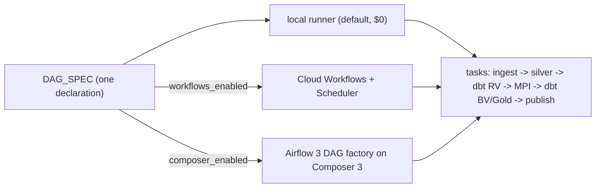

# Peer Diagram Review — architecture spine

Reviewer lens: can a technical peer understand architecture, run process, file lifecycle, developer flow, vault model and deployment from the 7 mermaid blocks alone. Memlog is decision authority.

## Syntax
All 7 blocks parse as valid mermaid (flowchart BT/LR/TD/TB, stateDiagram-v2, erDiagram). Quoted edge labels with `>=`, `.90`, `<` are fine. No blocking syntax defects.

## Coverage
| Concern | Block | Status |
|---|---|---|
| Module dependencies | L167 | present, contains a misleading cycle |
| Architecture | L238 | present, overloaded |
| Run process | L297 | present, one ordering defect |
| File lifecycle | L331 | present, storage-class region disconnected |
| Developer flow | L352 | present |
| Vault model | L375 | present, overloaded, RV/BV not separated |
| Deployment | L408 | present |
| Orchestration (AD-17 DAG_SPEC -> runner / Workflows / Composer) | none | **gap** |
| PHI boundary (AD-14) | partial in L238 | **gap** for a dedicated view |

## Findings and concrete edits

### F1 (high) Era naming inconsistent across AD-5, conventions and diagrams
AD-5 says `unmapped-<fp8>`; Conventions table says `unmapped_<fp8>`; run-flow diagram says `feed__unmapped_fp8`. Edit: pick `unmapped_<fp8>` (BigQuery/Iceberg identifiers disallow `-`), fix AD-5, and relabel L302 to `"append to feed__unmapped_<fp8> + ops.drift_report"`.

### F2 (high) Run flow sends unmapped era straight to quarantine, bypassing reconcile (L304)
AD-9 precedence is reconcile fail > unmapped era > cast threshold; AD-5 says unmapped lands in Bronze and is quarantined at Silver. Edit: replace `D2 --> Q` with `D2 --> E` and add a decision after pass: `E -->|pass| U{"era mapped?"}`; `U -->|no| Q`; `U -->|yes| F`. Also add Silver data-drift warn (AD-9: warns at Silver, blocks at Gold): `H -.->|"drift warn"| DR["ops.drift_report"]`.

### F3 (medium) Module dependency diagram (L167) shows a dbt <-> MPI cycle
`DBT -->|sources| MPI` and `MPI -->|reads Raw Vault| DBT` read as circular. Split dbt into `DBT_RV["dbt: stage + Raw Vault"]` and `DBT_BV["dbt: Business Vault + Gold"]`; edges `MPI --> DBT_RV` (reads), `DBT_BV --> MPI` (sources MPI tables, AD-13). Rename `PIPE["pipeline / dags"]` to `PIPE["pipeline: DAG_SPEC + runners"]` per AD-17. Consider dropping the 8 `--> CFG` edges in favour of a note "all modules depend on config/" to declutter.

### F4 (medium) Architecture diagram (L238) overloaded and missing the Silver->Raw Vault edge
~25 nodes, and dbt is drawn `RUN -->|dbt Fusion| RV` with no `SIL --> RV`, so the medallion chain breaks visually. Edits: add `SIL -->|dbt Fusion| RV`; label Spark subgraph `"Spark local or Dataproc Serverless 3.0"`; label `COMP["Composer 3 / Airflow 3 (flag, off)"]` and `WF["Workflows + Scheduler (flag, off)"]`; replace `PHI --- RV` with `RV -->|"PHI cols split"| PHI` ; collapse `OPS` to note `ops: file_lifecycle, quarantine, drift_report, run_events`. Move CFG edge to a subgraph-level note rather than only `RUN`.

### F5 (medium) File-lifecycle state diagram (L331)
`storage_class` composite is disconnected from the processing states, and the rerun path skips re-fingerprinting. Edits: render processing and storage as concurrent regions:
```
state landing_file {
  [*] --> landed
  ...processing states...
  --
  [*] --> standard
  standard --> coldline: 7 days
  coldline --> archive: 60 days
}
```
Change `quarantined --> reconciled: mapping added, rerun` to `quarantined --> bronze_loaded: mapping added, rerun` only if rerun re-reads from Bronze (state the fact). Add terminal states beyond `vault_loaded` or note "MPI/BV/Gold are run-scoped, not file-scoped". Rename `rejected_duplicate` transition label to `same name+sha256 exists`.

### F6 (medium) Vault ER diagram (L375) mixes Raw and Business Vault; same-as link one-sided
27 relationships in one graph. Split into two blocks: Raw Vault (hubs, sats, links, XTS) and Business Vault (HUB_PERSON, LINK_MEMBER_PERSON, LINK_PATIENT_PERSON, LINK_PERSON_SAME_AS, SAT_MPI_MATCH_DETAILS, LINK_VISIT_CLAIM, SAT_CLAIM_COMPUTED, PIT_PERSON_CLAIMS), titled "written by MPI (AD-13)" vs "written by dbt". `LINK_PERSON_SAME_AS` needs two HUB_PERSON roles: `HUB_PERSON ||--o{ LINK_PERSON_SAME_AS : master` and `HUB_PERSON ||--o{ LINK_PERSON_SAME_AS : duplicate`. Remittance 835 is in the canonical Silver set but has no hub/sat here; add `SAT_REMITTANCE` on HUB_CLAIM or explain. Add only `XTS_*` for one entity with a note "every sat has XTS" if that's the rule (AD-11).

### F7 (low) Developer flow (L352)
"DAG import" in CI implies Airflow is the default; relabel `"DAG_SPEC validate (+ Airflow import if composer_enabled)"`. `C6 git revert` is terminal; add `C6 --> C2` to show revert goes through PR. Add `make versions-check` to C0 (AD-20). Order of C1 (CLI apply before PR) is per user's CLI-first practice; add edge label "dev project only" so peers don't read it as prod.

### F8 (low) Deployment (L408)
`PR -->|OIDC read-only plan| WIF` reaches the same deploy SA as main; if a separate plan SA is intended, draw it; otherwise label "same SA, plan only". Add `RSA -.->|run as| RES` from Dataproc/Cloud Run and `"workflows, composer, looker, dataproc_schedule = off"` fine. Add backend comment "versioning needed before prod" already in label — ok.

### F9 (gap) Add orchestration diagram (AD-17)


### F10 (gap) Optional PHI boundary diagram (AD-14)
Small flowchart: RV/BV -> restricted_phi (by hash key) ; gold -> gold_deid authorized views (HMAC from Secret Manager) -> dashboard/extracts; no edge from dashboard to restricted_phi.

## Upstream PRD update needed (not spine defects)
- dbt Fusion blocking (PRD: Core blocking, Fusion non-blocking).
- Landing lifecycle Coldline 7d / Archive 60d, never deleted (PRD: 7-day delete).
- No Airflow by default; Composer behind flag (PRD assumes Airflow run).
- Dataproc Serverless 3.0 (PRD/repo on 2.x).
- Bronze per (source, feed, era) (PRD earlier shape).
Diagrams correctly reflect these overrides.
