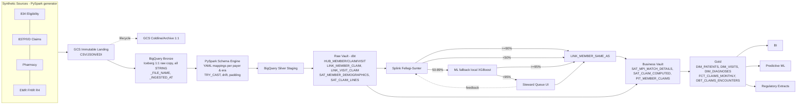

# Addendum: Implementation Context

This addendum holds the implementation material that does not belong in the PRD: technology choices, layout, diagram, trade-offs and research figures. It is input for the architecture workflow and does not bind it.

## A. Target Architecture (as stated by the user, verbatim)

Bronze: payer feeds (ANSI 834 eligibility, 837P/I/D + pharmacy claims) and EMR HL7 FHIR (visits/diagnoses/procedures), 2022-present -> GCS immutable landing (compressed CSV/JSON/EDI) -> GCS Coldline/Archive 1:1 retention; BigQuery external/Iceberg tables, 1:1 raw replica, all STRING/VARIANT, preserves headers & drift, partitioned by _FILE_NAME & _INGESTED_AT. Silver staging: config-driven PySpark schema engine (Serverless Spark/Dataproc) reading versioned YAML/JSON mappings per payer & era (Payer A 2022-2023, Payer A 2024-present, Payer B, EMR), column standardization (MBR_NO->member_id), TRY_CAST typification, drift resolution & default padding -> BigQuery Silver normalized canonical staging. Raw Data Vault (native BigQuery dbt + AutomateDV): stage models generate hash keys (MD5/SHA256/FARM_FINGERPRINT), HASHDIFF, LOAD_DATE, RECORD_SOURCE; HUB_MEMBER, HUB_CLAIM, HUB_VISIT; LINK_MEMBER_CLAIM, LINK_VISIT_CLAIM; SAT_MEMBER_DEMOGRAPHICS (name, DOB, SSN, gender, address), SAT_CLAIM_LINES (dx, billed/paid, status) SCD2. Business Vault: Splink Fellegi-Sunter MPI on demographics; >=90% auto-match, <50% new golden key, 50-89% (~2% edge cases: typos, twins, address inversions) -> ML fallback (XGBoost/BQ ML using claims history, visit proximity, provider patterns); ML>=95% auto-match else HITL steward queue UI (Retool/custom) with feedback retraining loop; LINK_MEMBER_SAME_AS (LINK_SAME_AS_HK, MASTER_MEMBER_HK golden key, TARGET_MEMBER_HK), SAT_MPI_MATCH_DETAILS (score, method, status), SAT_CLAIM_COMPUTED (patient responsibility, adjudication flags), PIT_MEMBER_CLAIMS (date spine). Gold: star schema DIM_PATIENTS (via golden key), DIM_VISITS, DIM_DIAGNOSES (ICD-10/CPT), FCT_CLAIMS_MONTHLY (partition claim date, cluster member key, via PIT, + SAT_CLAIM_COMPUTED); OBT_CLAIMS_ENCOUNTERS denormalized/materialized view clustered by master_member_hk & claim_id. Consumption: BI (Looker, PowerBI, Tableau), predictive ML (readmission, FWA, cost forecasting), regulatory exports (HEDIS, CMS, payer extracts).

**Decision note (2026-10-07):** "external/Iceberg" Bronze resolves to Iceberg. Bronze is a 1:1 copy of the raw files in BigLake/BigQuery Iceberg tables written by Spark. Silver normalized and everything downstream (Raw Vault, Business Vault, Gold) are native BigQuery tables, because dbt Fusion has no native Iceberg support (only through DuckDB, which does not suit a Spark-written lake). Iceberg stays where it adds value (open format, schema evolution, snapshots of raw data) and is kept out of the dbt layers to avoid that complexity.

**Corrections to §A for the architecture workflow (from review):** BigQuery has no VARIANT type (use JSON or a JSON string column). `_FILE_NAME` is a pseudo-column and cannot be a partition key; store the file name as a column and partition Bronze Iceberg tables by ingestion date. Member keys must be payer-qualified, claims need header and line grain plus 835 adjudication, and `DIM_DIAGNOSES` is split into diagnosis and procedure dimensions (see PRD FR-13, FR-22, FR-31 to FR-33). FARM_FINGERPRINT is excluded for portability. BI is a Streamlit dashboard in `dashboard/` (Power BI PBIP in Phase 2); Looker and Tableau are out of scope.

## B. Architecture Diagram

No mermaid source was provided with the request. The diagram below is drawn from §A, updated for the decisions in this PRD (Iceberg Bronze, local XGBoost), and does not replace it. Gold dimension names follow §A; the PRD splits `DIM_DIAGNOSES` (FR-24).



## C. Target Repo Layout (as stated by the user, verbatim)

**Note (decided 2026-10-07):** the `healthcare_data_platform/` top-level folder below is flattened into the repo root. Its contents live directly at the root, and the repo keeps its name, GitOps Iceberg Data Platform. The layout text is kept verbatim.

```
healthcare_data_platform/{README.md, .gitignore, CI (.github/workflows/ci_cd.yml), config/schemas/canonical_{claims,eligibility,visits}.json, config/mappings/payer_a/{claims_v2022_2023,claims_v2024_present,eligibility_v2022_present}.yaml, payer_b/claims_v2023_present.yaml, emr_facility_1/visits_v2022_present.yaml, ingestion_pyspark/{pyproject.toml, main_normalization_job.py, src/{reader,normalizer,writer}.py, src/utils/schema_validator.py}, identity_splink_ml/{pyproject.toml, run_splink_mpi.py, run_ml_edge_cases.py, config/{splink_settings.json, ml_model_config.yaml}, notebooks/mpi_model_retraining.ipynb}, dbt_bigquery_project/{dbt_project.yml, packages.yml, profiles.yml, macros/{dv_hash,build_hub,build_sat}.sql, models/1_silver_staging/{_silver_sources.yml, stg_normalized_{claims,members,visits}.sql}, models/2_silver_raw_vault/{hubs/hub_{claim,member,visit}.sql, links/link_{member_claim,visit_claim}.sql, satellites/sat_{claim_lines,member_demographics}.sql}, models/3_business_vault/{same_as_links/link_member_same_as.sql, satellites/sat_{claim_computed,mpi_match_details}.sql, pit/pit_member_claims.sql}, models/4_gold/{dimensions/dim_{patients,diagnoses,visits}.sql, facts/fct_claims_monthly.sql, obt/obt_claims_encounters.sql}}}
```

Suggested additions from the findings and research. These are not part of the user's layout:
- `datagen/` for the modular PySpark synthetic generator (one module per feed type, source, schema drift scenario and data drift scenario), with `datagen/README.md` on the generation process and `.env` sizing.
- `datagen/samples/` (or similar) for the committed 1,000-record sample file per feed. Full-size files are generated on Dataproc and never committed.
- `.env.example` with `RECORDS_PER_FILE=30000` and the file-span setting (2 years).
- `dags/` for the Airflow DAGs.
- `steward_ui/` for the Streamlit app.
- `dashboard/` (top level, decided 2026-10-07) for the Streamlit Gold dashboard and its Cloud Run container definition; in Phase 2 it also holds the source-controlled Power BI project (PBIP).
- `.github/workflows/` with the push-to-deploy (main) and PR validate pipelines (FR-38, FR-39); no `dependabot.yml` (FR-40).
- `config/clients/<profile>.yaml`.
- A Makefile with `generate`, `normalize`, `vault`, `mpi` and `e2e-local` targets.

## D. Technology Choices and Trade-offs (candidates for architecture)

| Concern | POC default | Production / client option | Trade-off |
|---|---|---|---|
| Spark runtime | Local PySpark on a GitHub Actions runner for CI and scheduled runs; Dataproc on Spot capacity (an ephemeral cluster with Spot secondary workers, or Serverless if architecture prefers it) for opt-in, capped manual runs, including full-size data generation (30k records per file, 2 years). Switched by `SPARK_RUNTIME=local\|serverless\|cluster` | Same, sized for the client | Dataproc has no free tier: about $0.06/DCU-hr, roughly $0.15–0.30 per small batch [S]. Spot pricing applies to cluster secondary workers, not Serverless standard tier. A daily Dataproc schedule (~$5–9/month) would exceed the budget, so it is not scheduled |
| Bronze tables | BigLake/BigQuery Iceberg tables written by Spark (decided): 1:1 copy of raw files, STRING columns, file name and ingest timestamp columns, partitioned by ingestion date | Same | Iceberg management fee is $0.12/DCU-hr; metastore operations are free up to about 5k Class A and 50k Class B [S]. Gives open format, schema evolution and snapshots for raw data |
| Silver and downstream storage | Native BigQuery tables (decided) for Silver, Raw Vault, Business Vault and Gold | Same | dbt Fusion has no native Iceberg support (only via DuckDB, a poor fit with Spark), so Iceberg stops at Bronze |
| Synthetic data size | `.env` `RECORDS_PER_FILE=30000`, 2 years of files, 5 schema drift scenarios plus data drift samples; generated on Dataproc Spot; only 1,000-record samples and a README in the repo | Sized per client | Keeps the repo light; full volume must stay within the USD 5 budget |
| Archive tier | Policy documented only | Coldline/Archive lifecycle | Minimum storage is 90 days for Coldline and 365 days for Archive [K] |
| EDI X12 | Pre-parse to JSONL; raw copy kept in landing | Same, or a commercial parser | X12 does not map to CSV |
| dbt | Core 1.10+ (blocking) and Fusion (non-blocking); `require-dbt-version: ">=1.10,<3.0"` | Fusion when it reaches GA for BigQuery | Fusion status is listed as "Preview" in some docs [S] |
| DV package | In-house `dv_hash` / `build_hub` / `build_link` / `build_sat` macros (primary); AutomateDV ≥0.11.5 as an optional spike | datavault4dbt (ghost records, PIT and bridge macros) | datavault4dbt has a Fusion warning on BigQuery `stage` [S] |
| MPI engine | Splink 4 with DuckDB: extract to Parquet, run EM, load scores back to BigQuery | Splink on the Spark backend at scale | Splink 4 has no first-class BigQuery backend [S/K] |
| ML fallback | Local XGBoost (decided) | BigQuery ML boosted trees | BQML costs about $312.50/TB for model creation [K]; the free-tier claim is unverified |
| Steward UI | Streamlit, local only (decided) | Retool (free up to 5 users), or a custom app | Steward UI stays local; the dashboard (below) is separate |
| BI | Streamlit dashboard in `dashboard/` on Cloud Run, min instances 0, BigQuery reads with `maximum_bytes_billed` (decided) | Power BI (PBIP, source-controlled in `dashboard/`) in Phase 2 | Cloud Run free tier covers idle and light use; Looker is out (no license). Alternatives if Cloud Run is unsuitable: Streamlit Community Cloud (public-only risk) |
| Delivery pipeline | GitHub Actions: push to `main` deploys changed components (Terraform apply, dbt build, Spark/DAG upload, dashboard deploy); PRs run plan and validate; no Dependabot (decided) | Same, with environment approvals | Speed over gating; target under 15 minutes push-to-deployed [ASSUMPTION] |
| Orchestration | Airflow 3.x DAGs; `dag.test()` and DagBag import tests in CI; `airflow standalone` locally; Airflow and provider versions pinned to a named Composer 3 image; Cosmos for the dbt Core track, `BashOperator` for the Fusion track | Cloud Composer 3 | Composer costs about $300–450/month [K]; the existing module is set to $10–12/day |
| CI auth | Workload Identity Federation | Same | No JSON keys |
| Region | `us-central1` (research) or `us-east1` (current) | Client choice | The GCS free 5 GB applies only to us-east1, us-west1 and us-central1 |
| Synthetic source | Pure PySpark and Faker; Synthea optional | Synthea for clinical depth | Synthea needs Java; keep it out of CI |

## E. Research Figures (confidence-tagged; verify before publishing)
- **BigQuery free tier [K]:** 1 TiB of queries and 10 GiB of storage per month. The Sandbox is unsuitable (60-day table expiry, DML limits).
- **GCS free tier [K]:** 5 GB-month of Standard storage, in US regions only. New accounts get a $300 credit for 90 days.
- **Default synthetic volume:** 30,000 records per file across 2 years of files per feed (set in `.env`); full-size files are generated on Dataproc, and only 1,000-record samples are committed.
- **Guardrails:** `maximum_bytes_billed` set in profiles and every other BigQuery client, a $5 budget alert (alert only, not a stop), dataset default table expiration and a teardown target, and partitioning and clustering on large tables.
- **Unverified:** the BQML figures and the Composer per-DCU snippet came out garbled or unverified ([S]/[K]). Confirm them on cloud.google.com before quoting them in the README.

## F. Current Repo Reuse Map (from POC findings)
- **Keep:**
  - `infra/` structure and the state backend
  - the composer module, with its flag set to `false`
  - CI job skeletons and GCP authentication
  - Makefile and devcontainer
  - TaskFlow DAG idioms and success markers
  - the Spark pytest harness
- **Replace:**
  - all taxi Spark logic (`TRIP_COLUMNS`)
  - the dbt `nyc_taxi_gold` models and the seed
  - the LookML content and the `infra/modules/looker` module (scrapped; kept on `v1`)
  - the `composer-sync.yml`, `release.yml` and `terraform.yml` workflows (by FR-38/FR-39 pipelines)
  - the Hadoop-catalog Iceberg path (Bronze moves to BigLake/BigQuery Iceberg; Silver becomes native BigQuery) and the BigLake Silver registration
  - the NEARLINE lifecycle rule
- **Add in Terraform:**
  - landing bucket with an unlocked retention policy and content-hashed object names (no object versioning: GCS does not combine it with retention)
  - datasets `bronze_raw`, `silver_staging`, `raw_vault`, `business_vault`, `gold` and `mpi_steward`
  - `restricted_phi` dataset for `SAT_MEMBER_SENSITIVE`, policy tags taxonomy and data masking
- **Drop:** `gitops/` (Argo CD scaffolding) and `.github/dependabot.yml`.
